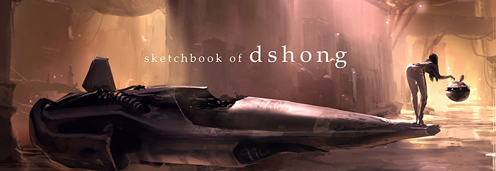

# This is a test site

## By **David M'rabu**

## Description

This is a website that shows my progress as a software developer and this repository deals with the implementation of ideas I have learnt.  

## Setup/Installation Requirements

* A computer.
* Internet access.
* A web browser to view the live github pages site.
* Install Git on you computer if you want to clone it and have a working understanding of Git and Github, To make your clone process an easy and pleasant one.

For the best viewing experience please use a laptop or desktop and if possible using the chrome browser for the best experience possible.

## Technologies Used

The technologies used are as follows HTML and CSS.

## Support and contact details

If you need to contact us, The contact information can be found on the website.

### License

* This website is under the MIT license *

#### Copyright (c) 2021 *Hive corporation*
